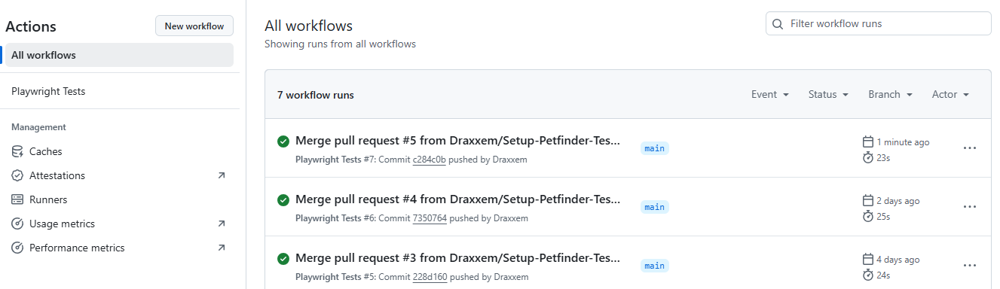
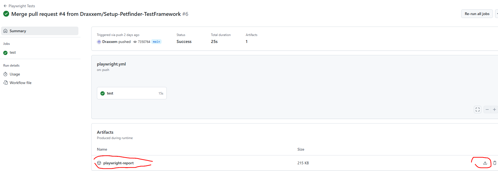
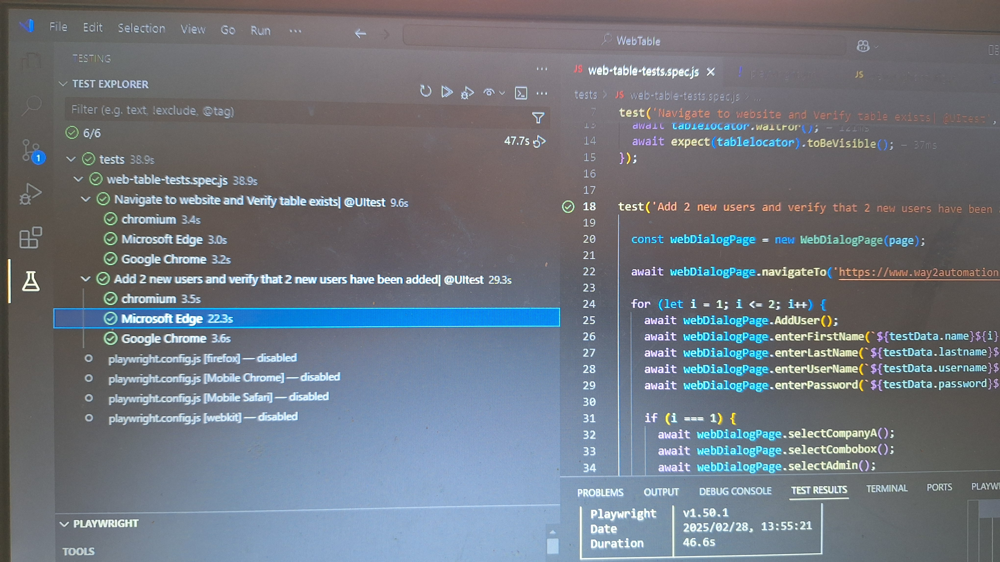

# WebTable

#Setup instructions

Download latest version of Visual Studio Code
1. Clone this repo - https://github.com/Draxxem/WebTable.git
2. Once cloned open the project
3. In the terminal run the following command to get all required dependencies 'npm ci'

How to run the tests
- From terminal
1. To execute all tests run the following command 'npx playwright test
2. To execute all tests tagged as '@UItests' only, run the following command 'npx playwright test --grep "@UItest"'
2. To view test Report run 'npx monocart show-report test-results/report.html'

#OR

- From Test Explorer
1. Install Playwright Test for VSCode extension
2. Test will be visible from Test Explorer

#Guthub Workflow 

A test job is triggered whenever a branch gets merged into main branch
1. You can also view test results of workflow runs on Github Action tab
1. A Test report is available to download by selecting a Workflow run ---> (https://github.com/Draxxem/WebTable/actions)

#Overview of project structure
- The root directory contains key configuration files such as package.json for dependencies and scripts, .gitignore 
- The tests folder contains the file with the tests
- test-data folder contains test data stored in a .json file
- Pages folder contains to two .js files, one file meant to find elements for webpage and the other to find elements of the input form dialog
- .github/Workflows folder contains the .yml with instructons for Github Workflow

#Any assumptions or decisions made
- For the test where you need to add 2 users to the table and then verify that they are successfully stored, I made the decision to do the assertion based on how many total records are in the table. Before test is executed table has 7 records, after test execution table has 9 records

#List of tools and resources used
- VSCode
- Node.js
- Playwright

Evidence:

